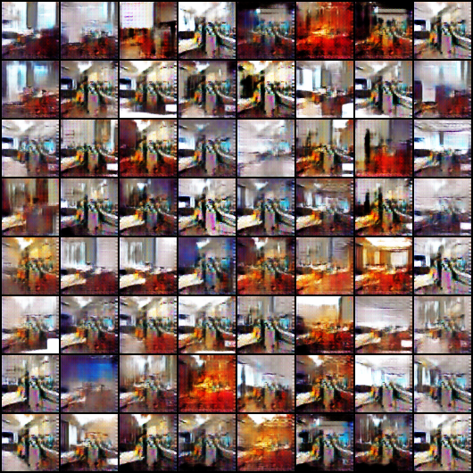
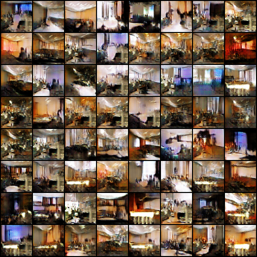
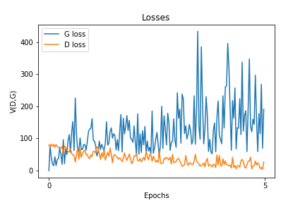
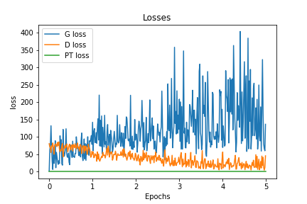

# EBGAN-pytorch
A pytorch implementation of "Energy-based Generative Adversarial Network"

## result

LSUN - conference room 

    EBGAN				                                | EBGAN-pt                                    
    :---:                                        	   | :---:                                         
    	| 
	

5eps results 

    EBGAN				                                | EBGAN-pt                                    
    :---:                                        	   | :---:                                         
    	| 
	
	
losses

    EBGAN				                                | EBGAN-pt                                    
    :---:                                        	   | :---:                                         
    	| 